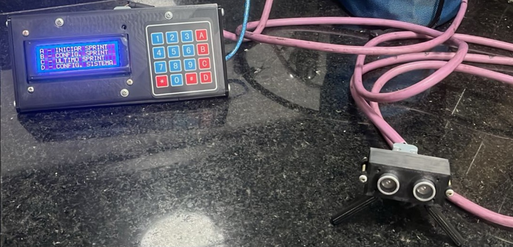
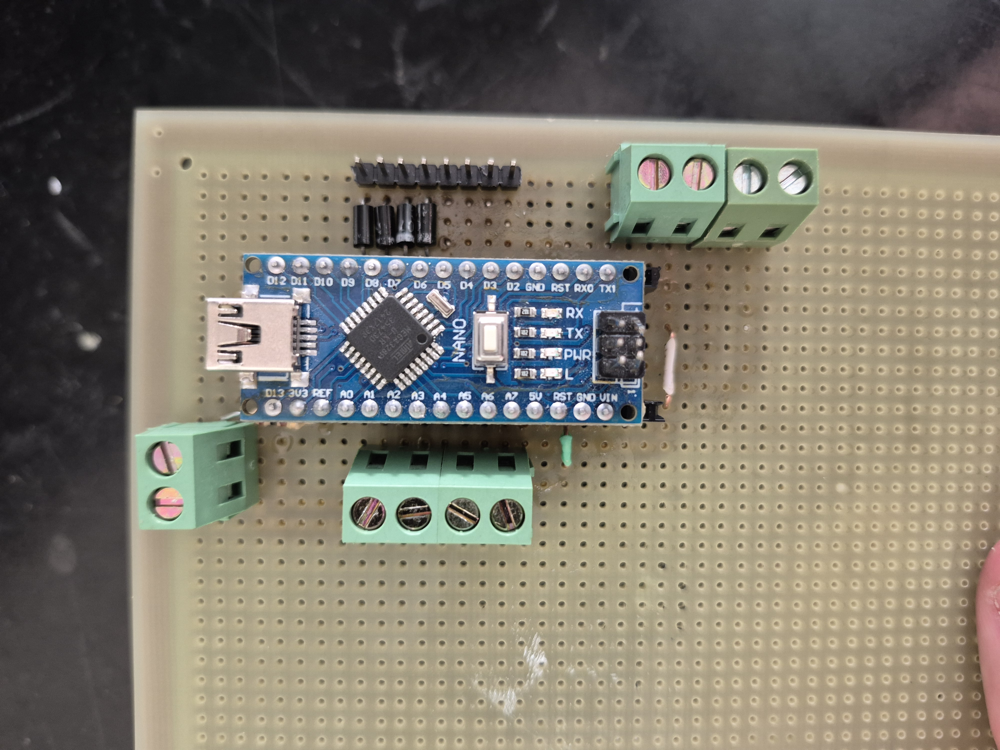
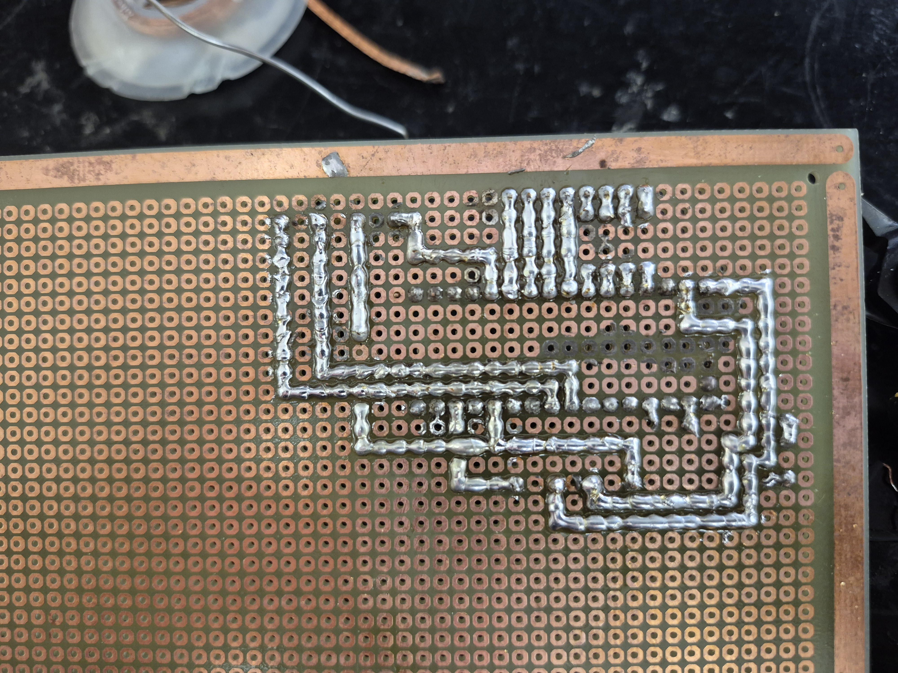
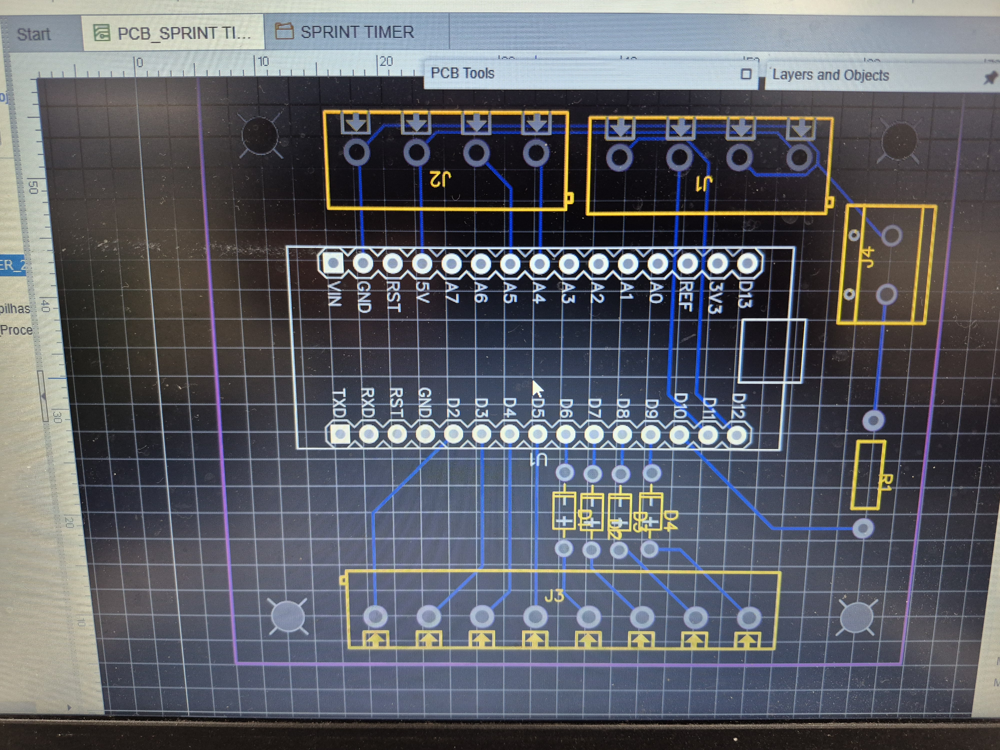

# SprintTimer
O projeto consiste em um cronômetro destinado à medição de tempos de atletas durante treinamentos de futebol. O sistema baseia-se em um sensor ultrassônico, responsável por detectar a ultrapassagem do atleta em uma marca predefinida, com base na medição de distância. , Um arduino realizará o processamento dos dados para registrar os tempos.

